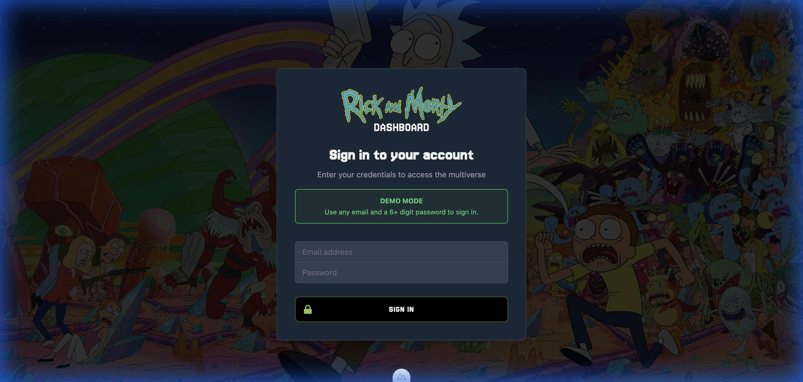
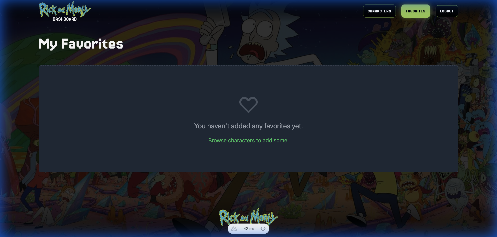
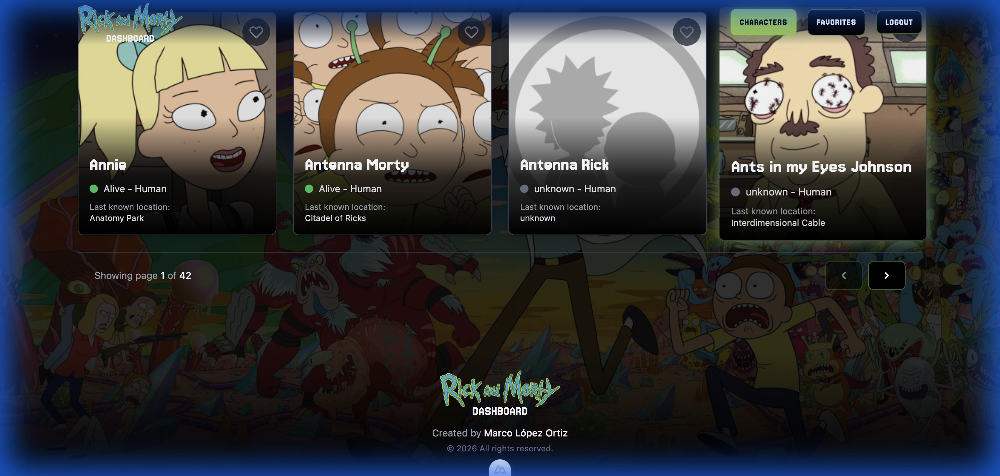

# Rick and Morty Dashboard - Walkthrough

## Overview

This project is a Vue.js application using **Nuxt 3**, **Pinia**, and **Tailwind CSS** to interact with the Rick and Morty API. It demonstrates core frontend development concepts including authentication patterns, state management, API integration, and responsive data visualization.

Everything has been verified to be working correctly, including the latest UI customizations for a premium look and feel.

## Features

### 1. Authentication

- **Simulated Login**: Accepts any email and a password > 6 characters.
- **Login View Refined**: Added the official Rick & Morty logo centered above the sign-in title for better branding.
- **Demo Notice**: Information block explaining the access credentials for the demo.
- **Route Protection**: Middleware redirects unauthenticated users to `/login`.
- **State Persistence**: Uses cookies to maintain session across reloads.

### 2. Character Dashboard

- **Data Fetching**: Retrieves characters from the public API.
- **Search**: Real-time filtering by character name.
- **Pagination**: Easy navigation through character sets.
- **Redesigned Cards**:
  - Taller images (`h-80`) for better visual impact.
  - Text overlays the image at the bottom with a semi-transparent black background (`bg-black/75`) and backdrop blur.
  - Favorite icon positioned over the image.
  - Hover effect scales the card slightly (`scale-105`).

### 3. Favorites System

- **Error/Empty States**: Unified "No results" and "API Error" views with a 100% width container, `h2` headings, and an animated `error.gif`.
- **Button Styles**: Homogenized all buttons with the `.btn-portal` class (Jersey font, uppercase, black bg, green border, green hover).
- **Global State**: Pinia store manages the list of favorites.
- **Persistence**: Saves favorites to `localStorage`.
- **Dedicated View**: `/favorites` route displays selected characters.

### 4. Customization & SEO

- **Theming**: Dark mode with a parallax background image (`fixed` attachment).
- **Header**: Customized fixed header with transparent-to-black gradient and SVG logo.
- **Footer**: Sticky footer with black-to-transparent gradient and centered info.
- **SEO**: Full meta tag configuration (Title, Description, Keywords, Canonical, Robots).
- **Accessibility**: Image `alt` and `title` attributes throughout. Improved pagination padding for touch targets.

## Verification Scenarios

### 1. Initial Load & Auth

- **Action**: Open `/`.
- **Result**: Redirects to `/login`.
- **Test**: Login with `test@example.com` / `password123`. Redirects to Dashboard.

### 2. Dashboard Interaction

- **Action**: Scroll through characters, use search bar.
- **Result**: Grid updates instantly. Parallax background flows smoothly.
- **Cards**: Text is clearly readable over the image thanks to the dark overlay.

### 3. Favorites Management

- **Action**: Click "heart" icon on varied characters.
- **Result**: Icon turns red. Count in Navbar updates.
- **Check**: Go to `/favorites`. Characters appear correctly with the new card design.

### 4. Persistence

- **Action**: Refresh the page.
- **Result**: User stays logged in. Favorites list remains intact.

### 5. Deployment Readiness

- **Build**: `npm run build` completes successfully.
- **Preview**: `npm run preview` launches the optimized production build.

## Running the Project

1.  **Install**: `npm install`
2.  **Dev**: `npm run dev` (http://localhost:3000)
3.  **Build**: `npm run build`
4.  **Preview**: `npm run preview`

## Visual Walkthrough

_Branded login page with demo instructions_

_Navigation showing 'Favorites' active state and portal-style buttons_

_Pagination controls with improved accessibility padding and spacing_

### Video Overview

_Full application demonstration walkthough_
